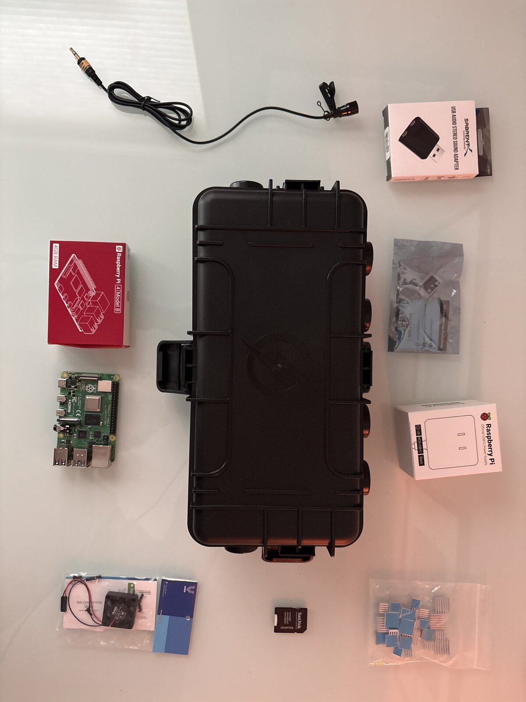
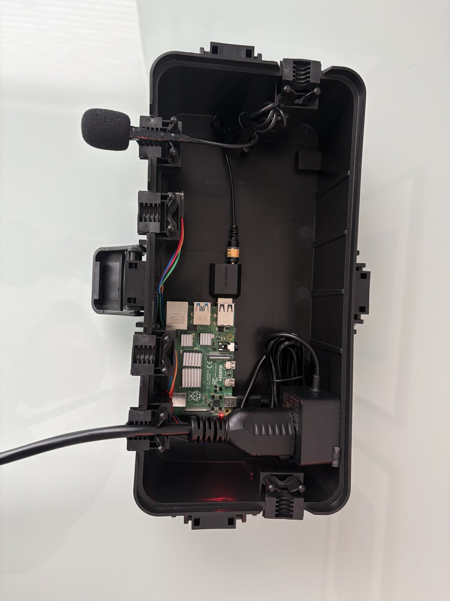
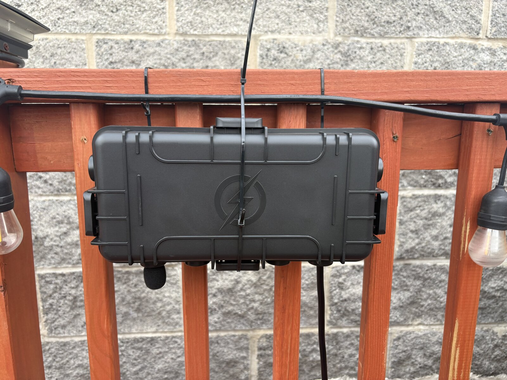

# Behind the Build

Birdbox's data engineering runs on real, physical hardware — a Raspberry Pi in a rooftop-mounted enclosure, not a cloud simulation. This page documents the actual build.

## Before assembly

Raspberry Pi 4 (4GB), a lavalier-style condenser mic, a USB sound card (the Pi's onboard audio doesn't support mic input), an official USB-C power supply, a microSD card, heatsinks, a small cooling fan, and a repurposed IP54-rated outdoor electrical enclosure (sold as a weatherproof cord/power-strip cover) as the housing. IP54 means protected against dust ingress and splashing water from any direction — not submersion-proof, but a reasonable, practical fit for a housing mounted under a rooftop overhang rather than fully exposed.

## Mid-assembly

The Pi is secured inside using VHB mounting tape rather than standoffs — a simpler, vibration-resistant fix for a small enclosure with no drilled mounting holes — with the USB sound card and mic cable routed through a cable pass-through in the enclosure wall. Heatsinks are on the SoC, RAM, and USB controller — continuous 24/7 inference workloads run the Pi warm, which is also the direct reason `thermal_sentinel.py` exists in the pipeline: a systemd-supervised watchdog that halts BirdNET-Go inference if internal temperature crosses a threshold, with a cooldown period before resuming (see [the incident log](./incidents.md) for the reliability work built around this hardware).

## Deployed

Mounted on a rooftop railing, weatherproof side down, secured with cable ties against wind rather than a permanent fixture — deliberately non-destructive to the railing itself. Power and network run down to the ThinkCentre hub indoors. This exact device is the one that went fully unresponsive during the cron-stacking incident documented in the [incident log](./incidents.md) — the debugging process there happened on this hardware, not a VM.

## Why physical hardware at all

The rest of Birdbox — dbt, Dagster, DuckDB, Evidence — would run identically against synthetic or downloaded data. Building the actual sensor is what makes the project a genuine end-to-end system rather than a portfolio exercise against a public dataset: real audio, real intermittent connectivity, real thermal constraints, real weatherproofing tradeoffs, and real failure modes (see the [incident log](./incidents.md)) that only show up when hardware is involved.
